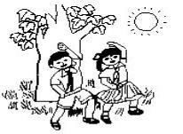
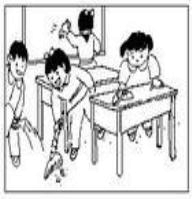
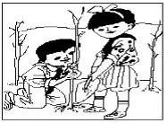
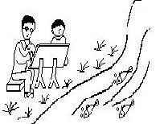
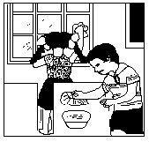

看图片，写英文句子
============

看下面的图片，写出对应的英文句子。

* 看图，请写明什么时间？有谁在什么地方干什么？他们在干什么？

>

> 星 期 六 的 早 上 ， 阳 光 明 媚 。 冬 冬 和 兰 兰 在 公 园 里 的 大 树 下 做 操 。 胸 前 的 红 领 巾 在 太 阳 的 照 射 下 显 得 更 加 鲜 艳 了 。

> It's sunny at Saturday morning. Dongdong and Lanlan are doing practice under a tree in a park. The red scarf before their chest become more bright under the sun light.

* 看图

>

> 一 天 下 午 放 学 后 ， 同 学 们 一 起 打 扫 教 室 。 他 们 有 的 扫 地 ， 有 的 擦 桌 子 ， 还 有 的 擦 玻 璃 。 一 会 就 把 教 室 打 扫 干 净 了 。

> TODO

* 看图，请你仔细观察，这是什么季节？谁在哪里干什么？你会 表扬他们吗？为什么？请写几句话吧。

> 

> 植 树 节 来 了 ， 老 师 带 领 同 学 到 山 上 植 树 ， 为 祖 国 绿 化 荒 山 ， 大 家 可 高 兴 了 。 你 看 ， 小 东 扶 着 小 树 ， 兰 兰 培 土 ， 他 们 干 得 多 认 真 呀 。

> TODO

* 看图，谁和谁在什么地方？干什么？

> 

> 春 天 到 了 ， 到 处 一 片 绿 色 。 小 明 和 爸 爸 一 起 到 小 河 边 写 生 。

* 请你仔细看图，写两三句话

> 

> 下 午 放 学 后 ， 兰 兰 和 冬 冬 在 教 室 里 打 扫 卫 生 。 兰 兰 抹 窗 子 ， 冬 冬 抹 桌 子。 他 们 把 教 室 打 扫 得 干 干 净 净 的 。

> TODO

